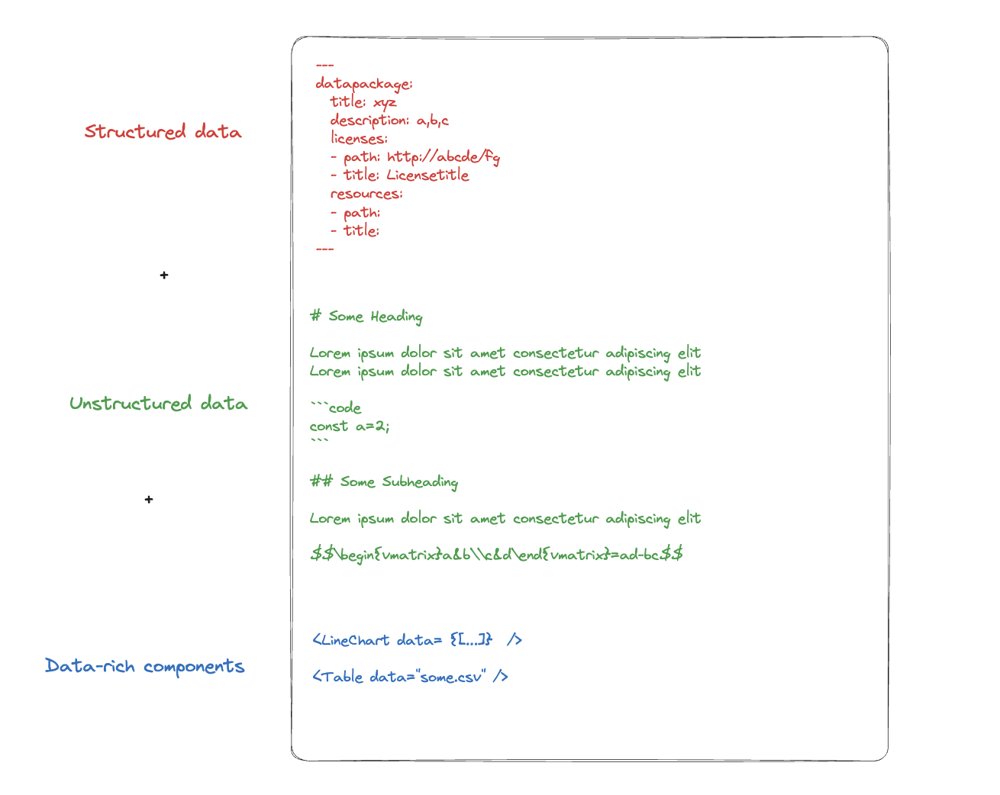
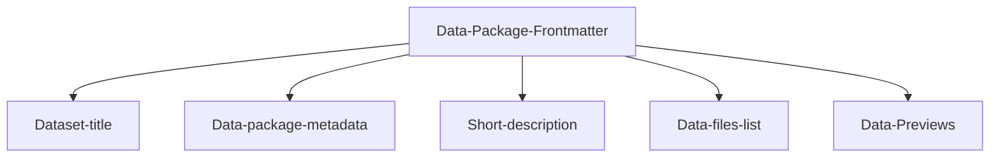

---
datapackage:
  title: Welcome to your template dataset page!
  description: This is a template for publishing your dataset with Datahub Cloud.
  created: 2024-01-01
  updated: 2024-01-31
  licenses:
  - path: http://opendatacommons.org/licenses/pddl/
    title: Open Data Commons Public Domain Dedication and License v1.0
  sources:
  - path: http://link.to/data/source
    title: Link to data source
  resources:
  - name: c02-per-decade
    title: C02 PPM per decade
    description: C02 PPM per decade
    lastModified: 2024-01-15
    path: data.csv
---

<div class="hero">
    <h1 class="hero-title">Dataset Template<br/></h1>
    <p class="hero-description">This section displays the main content of your site. The content above is the metadata section, known as the Data Package frontmatter.</p>
</div>

## Overview

This repository contains a template for publishing datasets using Datahub Cloud. The structure consists of frontmatter (metadata), followed by content-rich elements and markdown text.



The frontmatter includes metadata like dataset title, description, and sources. This data is processed and displayed along with unstructured content such as charts, tables, or text.

> [!info]
> **Frontmatter**: The metadata at the top of the markdown file, enclosed in triple dashes (`---`). This metadata is used for organizing and processing the content.



This is the frontmatter in this README.md:

```
---
datapackage:
  title: Welcome to your template dataset page!
  description: This is a template for publishing your dataset with Datahub Cloud.
  created: 2024-01-01
  updated: 2024-01-31
  licenses:
  - path: http://opendatacommons.org/licenses/pddl/
    title: Open Data Commons Public Domain Dedication and License v1.0
  sources:
  - path: http://link.to/data/source
    title: Link to data source
  resources:
  - name: c02-per-decade
    title: C02 PPM per decade
    description: C02 PPM per decade
    lastModified: 2024-01-15
    path: data.csv
---
```

This can be updated if publishing datasets with additional files or removed entirely if the content is only markdown (e.g., blogs, articles, etc.).

## Next Steps After Publishing

Once the template is published, markdown files can be added to the repository, organized into subdirectories as needed. It is possible to enhance the content with additional data visualizations and supported markdown features.

For a complete list of markdown features, refer to the [Markdown syntax support](https://datahub.io/docs/DataHub+Cloud/Markdown+syntax+support)

Markdown Examples:

> Here are a few examples:
> Example Callout This is an info block supporting markdown and ```[[Internal link|wikilinks]]```.

Code blocks can also be embedded easily:

```
const ExampleCode = () => {
  return <div> .... </div>;
};
```

### Enhancing the Template

This template is designed primarily for datasets. If no dataset is available, consider exploring alternative templates here. https://datahub.io/docs#templates

To maximize the impact of datasets, consider adding visuals (e.g., graphs, charts), sidebar navigation, or custom styles (CSS and HTML). See the following links for more information:

<div class="middle-button-container">
    <a href="https://datahub.io/docs/DataHub+Cloud/Add+sidebar+navigation" class="middle-button">Add sidebar navigation</a>
</div>

<div class="middle-button-container">
    <a href="https://datahub.io/docs/DataHub+Cloud/Add+visuals+and+data-rich+components" class="middle-button">Add visuals and data-rich components</a>
</div>


<div class="middle-button-container">
    <a href="https://datahub.io/docs/DataHub+Cloud/Customize+Your+DataHub+Cloud+Site+with+CSS" class="middle-button">Customize your site with CSS and HTML</a>
</div>

<div class="middle-button-container">
    <a href="https://datahub.io/docs/DataHub+Cloud/Configuring+Nav+bar+and+SEO+fields" class="middle-button">How to Configure Basic SEO Fields and Nav Bar</a>
</div>

---

> [!important]
> For any questions, refer to the [Docs](https://datahub.io/docs)

## Testing data-rich components

Below is a data table rendered from the data.csv file:
<FlatUiTable
  data={{
    url: 'data.csv'
  }}
 />

Customized LineChart based on predefined data:
 <LineChart 
  data={{ url: 'data.csv' }} 
  title="C02 PPM per decade" 
  xAxis="year"
  yAxis="value"
  color="key"
/>

 <LineChart 
  data={{ url: 'data.csv' }} 
  title="C02 PPM per decade" 
  xAxis="year"
  yAxis="co2"
  color="key"
/>

<LineChart
  data={{
    values: [
      { date: '2019-01-01', foo: 10, bar: 10, key: 30 },
      { date: '2020-01-02', foo: 30, bar: 20, key: 20 },
      { date: '2021-01-03', foo: 40, bar: 20, key: 10 },
      { date: '2022-01-04', foo: 1, bar: 60, key: 20 }
    ]
  }}
  title="CO2 PPM per Decade"
  xAxis="date"
  color="key"
/>

<LineChart
  data={{
    values: [
      { date: '2019-01-01', foo: 10, bar: 10, key: 30 },
      { date: '2020-01-02', foo: 30, bar: 20, key: 20 },
      { date: '2021-01-03', foo: 40, bar: 20, key: 10 },
      { date: '2022-01-04', foo: 1, bar: 60, key: 20 }
    ]
  }}
  title="CO2 PPM per Decade"
  xAxis="foo"
  color="key"
/>

<LineChart
  data={{
    values: [
      { date: '2019-01-01', foo: 10, bar: 10, key: 30 },
      { date: '2020-01-02', foo: 30, bar: 20, key: 20 },
      { date: '2021-01-03', foo: 40, bar: 20, key: 10 },
      { date: '2022-01-04', foo: 1, bar: 60, key: 20 }
    ]
  }}
  title="CO2 PPM per Decade"
  xAxis="foo"
  yAxis="value"
  color="Values"
/>

For more possibilities, explore the Datahub docs:

<div class="middle-button-container">
    <a href="https://datahub.io/docs" class="middle-button">Go to the docs</a>
</div>
