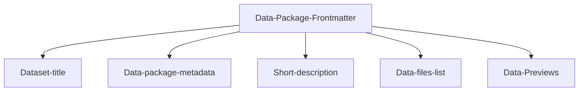

---
datapackage:
  title: Welcome to your template dataset page!
  description: This is a template for publishing your dataset with Datahub Cloud. Click on "Read more" to go to a quick overview of the template.  
  licenses:
  - path: http://opendatacommons.org/licenses/pddl/
    title: Open Data Commons Public Domain Dedication and License v1.0
  resources:
  - path: data.csv
    title: C02 PPM per decade
    name: c02-per-decade
    format: csv
    schema:
      fields:
      - name: year
        type: date
      - name: co2
        type: number
---

Welcome to the body of your dataset site. Everything above this section is part of the Data package front matter.

# Overview

Here is a quick overview of the template structure:

![[Overview.png]]

## Structured data



Feel free to customize the data package frontmatter accordingly when publishing your own data. 

## Unstructured data

You can add as many markdown files to your GitHub repository as you like, and you can freely nest them in subdirectories. You can also enhance your content with other data visualisation components and markdown features.

> Note: For a full list of supported markdown features visit https://flowershow.app/docs/syntax

Here are some quick examples:

> [!info] This is cool!
> Here's a callout block.
> It supports **markdown** and [[Internal link|wikilinks]].

Or you can quickly embed a piece of code as follows:

```
const ExampleCode = () => {
  return <div> .... </div>;
};
```

Or simply pass an inline code like this: `print("hello world!")`


---

If your dataset is part of a larger dataset collection, you may want to start by listing the related datasets here in a catalog-like component with search and facets like this one: 

<Catalog
  datasets={[
    {
      _id: '07026b22d49916754df1dc8ffb9ccd1c31878aae',
      file_path: 'content/dataset-4/index.md',
      metadata: {
        'details-of-task': 'Detect and categorise abusive language in social media data',
        collection: 'Climate data',
        'level-of-annotation': [
          'Posts'
        ],
        'link-to-data': 'https://doi.org/10.6084/m9.figshare.19333298.v1',
        'link-to-publication': 'https://arxiv.org/abs/2107.13592',
        medium: [
          'Text'
        ],
        'percentage-abusive': 13.2,
        platform: [
          'Instagram',
          'Youtube'
        ],
        reference: 'Nurce, E., Keci, J., Derczynski, L., 2021. Detecting Abusive Albanian. arXiv:2107.13592',
        'size-of-dataset': 11874,
        'task-description': 'Hierarchical (offensive/not; untargeted/targeted; person/group/other)',
        title: 'Climate Change'
      },
      url_path: 'dataset-4'
    },
    {
      _id: '42c86cf3c4fbbab11d91c2a7d6dcb8f750bc4e19',
      file_path: 'content/dataset-1/index.md',
      metadata: {
        'details-of-task': 'Enriched versions of the OffensEval/OLID dataset with the distinction of explicit/implicit offensive messages and the new dimension for abusive messages. Labels for offensive language: EXPLICIT, IMPLICT, NOT; Labels for abusive language: EXPLICIT, IMPLICT, NOTABU',
        collection: 'Economy',
        'level-of-annotation': [
          'Tweets'
        ],
        'link-to-data': 'https://github.com/tommasoc80/AbuseEval',
        'link-to-publication': 'http://www.lrec-conf.org/proceedings/lrec2020/pdf/2020.lrec-1.760.pdf',
        medium: [
          'Text'
        ],
        'percentage-abusive': 20.75,
        platform: [
          'Twitter'
        ],
        reference: 'Caselli, T., Basile, V., Jelena, M., Inga, K., and Michael, G. 2020. "I feel offended, don’t be abusive! implicit/explicit messages in offensive and abusive language". The 12th Language Resources and Evaluation Conference (pp. 6193-6202). European Language Resources Association.',
        'size-of-dataset': 14100,
        'task-description': 'Explicitness annotation of offensive and abusive content',
        title: 'Economic Data and Indicators'
      },
      url_path: 'dataset-1'
    },
    {
      _id: '80001dd32a752421fdcc64e91fbd237dc31d6bb3',
      file_path: 'content/dataset-2/index.md',
      metadata: {
        'details-of-task': 'Incivility',
        collection: 'Stock Market',
        'level-of-annotation': [
          'Posts'
        ],
        'link-to-data': 'http://alt.qcri.org/~hmubarak/offensive/AJCommentsClassification-CF.xlsx',
        'link-to-publication': 'https://www.aclweb.org/anthology/W17-3008',
        medium: [
          'Text'
        ],
        'percentage-abusive': 0.81,
        platform: [
          'AlJazeera'
        ],
        reference: 'Mubarak, H., Darwish, K. and Magdy, W., 2017. Abusive Language Detection on Arabic Social Media. In: Proceedings of the First Workshop on Abusive Language Online. Vancouver, Canada: Association for Computational Linguistics, pp.52-56.',
        'size-of-dataset': 32000,
        'task-description': 'Ternary (Obscene, Offensive but not obscene, Clean)',
        title: 'Stock Market Data'
      },
      url_path: 'dataset-2'
    },
    {
      _id: '96649d05d8193f4333b10015af76c6562971bd8c',
      file_path: 'content/dataset-3/index.md',
      metadata: {
        'details-of-task': 'Detectioning CDC from abusive comments',
        collection: 'Climate data',
        'level-of-annotation': [
          'Posts'
        ],
        'link-to-data': 'https://github.com/shekharRavi/CoRAL-dataset-Findings-of-the-ACL-AACL-IJCNLP-2022',
        'link-to-publication': 'https://aclanthology.org/2022.findings-aacl.21/',
        medium: [
          'Newspaper Comments'
        ],
        'percentage-abusive': 100,
        platform: [
          'Posts'
        ],
        reference: 'Ravi Shekhar, Mladen Karan and Matthew Purver (2022). CoRAL: a Context-aware Croatian Abusive Language Dataset. Findings of the ACL: AACL-IJCNLP.',
        'size-of-dataset': 2240,
        'task-description': 'Multi-class based on context dependency categories (CDC)',
        title: 'Air pollution data'
      },
      url_path: 'dataset-3'
    }
  ]}
  facets={[
    'collection',
    'platform'
  ]}
/>

This makes it easy to navigate and quickly find or filter down the data you're looking for. You can add as many facets as you'd like.

---

`==Excel==`

If you're working a lot with Excel files, you can embed a preview of your file such as this one:

<Excel url="https://storage.portaljs.org/IC-Gantt-Chart-Project-Template-8857.xlsx" />

Simply upload your Excel file to your Github repository and replace the URL with the relative path of the uploaded file.

> Note: This component allows you to present all tabs in your Excel file. You can sort the rows by clicking on the Column name and you can also filter each column by clicking on the triple bar symbol next to the Column name.

## Data-rich components

You can use a number of data preview and data visualization components in order to make your dataset more insightful. 

### Map

In case you're dealing with geo data, you can visualize your data on a GeoJSON polygons and points map with auto zoom in the points layer:

<Map
  autoZoomConfiguration={{
    layerName: 'Points'
  }}
  center={{
    latitude: 45,
    longitude: 0
  }}
  layers={[
    {
      data: 'https://opendata.arcgis.com/datasets/9c58741995174fbcb017cf46c8a42f4b_25.geojson',
      name: 'Points',
      tooltip: true
    },
    {
      colorScale: {
        ending: '#00ff00',
        starting: '#ff0000'
      },
      data: 'https://d2ad6b4ur7yvpq.cloudfront.net/naturalearth-3.3.0/ne_10m_geography_marine_polys.geojson',
      name: 'Polygons',
      tooltip: true
    }
  ]}
  title="Polygons and points"
  zoom={2}
/>

### Data Table

Let's start by adding a table of your data like the one below:

<FlatUiTable url="https://storage.openspending.org/alberta-budget/__os_imported__alberta_total.csv" />

### Data visualization

Now let's add line chart:

<LineChart
  data="https://raw.githubusercontent.com/datasets/oil-prices/main/data/wti-year.csv"
  title="Oil Price x Year"
  xAxis="Date"
  yAxis="Price"
/>

There are also other types of charts and graphs you can use to enhance your dataset. You can create charts with Plotly, see how it renders: 

> [!info] This is a Plotly Bar Chart:

<PlotlyBarChart
  data={[
    {
      temperature: -0.41765878,
      year: '1850'
    },
    {
      temperature: -0.2333498,
      year: '1851'
    },
    {
      temperature: -0.22939907,
      year: '1852'
    },
    {
      temperature: -0.27035445,
      year: '1853'
    },
    {
      temperature: -0.29163003,
      year: '1854'
    }
  ]}
  xAxis="year"
  yAxis="temperature"
/>

> [!info] This is a Plotly Line Chart:

<PlotlyLineChart
  data={[
    {
      temperature: -0.41765878,
      year: '1850'
    },
    {
      temperature: -0.2333498,
      year: '1851'
    },
    {
      temperature: -0.22939907,
      year: '1852'
    },
    {
      temperature: -0.27035445,
      year: '1853'
    },
    {
      temperature: -0.29163003,
      year: '1854'
    }
  ]}
  xAxis="year"
  yAxis="temperature"
/>

> [!info] You can also integrate VegaLite charts:

<VegaLite
  data={{
    table: [
      {
        x: 1850,
        y: -0.418
      },
      {
        x: 2020,
        y: 0.923
      }
    ]
  }}
  spec={{
    $schema: 'https://vega.github.io/schema/vega-lite/v4.json',
    data: {
      name: 'table'
    },
    encoding: {
      x: {
        field: 'x',
        type: 'ordinal'
      },
      y: {
        field: 'y',
        type: 'quantitative'
      }
    },
    mark: 'bar'
  }}
/>


For a full list and API of available data visualisation components visit https://storybook.portaljs.org
