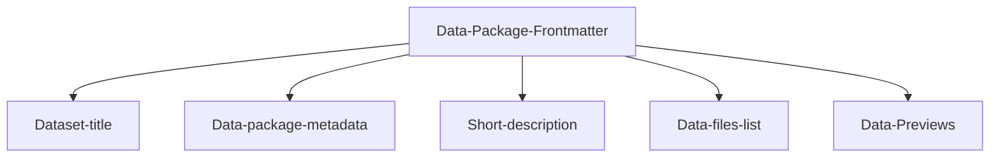

---
datapackage:
  title: Welcome to your template dataset page!
  description: This is a template for publishing your dataset with Datahub Cloud.
  created: 2024-01-01
  updated: 2024-01-31
  licenses:
  - path: http://opendatacommons.org/licenses/pddl/
    title: Open Data Commons Public Domain Dedication and License v1.0
  sources:
  - path: http://link.to/data/source
    title: Link to data source
  resources:
  - name: c02-per-decade
    title: C02 PPM per decade
    description: C02 PPM per decade
    lastModified: 2024-01-15
    path: data.csv
---

<div class="hero">
    <h1 class="hero-title">Readme.md content<br/></h1>
    <p class="hero-description">Welcome to the body of your site. Everything above this section is part of the Data package front matter. I am adding here markdown text and other data-rich elements and they render beautifully.</p>
</div>


## Overview

Here is a quick overview of the template you're looking at:

![[Overview.png]]

We have a frontmatter at the top, followed by the "body" of your site, which consists of unstructured data and/or data-rich components.

Feel free to customize the data package frontmatter accordingly when publishing your own data. 

> [!info]
> Frontmatter refers to the metadata placed at the beginning of the markdown file enclosed within triple dashes (---). This metadata provides essential information about the file and its content, enabling better organization, configuration, and processing by tools and platforms.



This is the frontmatter in this README.md:

```
---
datapackage:
  title: Welcome to your template dataset page!
  description: This is a template for publishing your dataset with Datahub Cloud.
  created: 2024-01-01
  updated: 2024-01-31
  licenses:
  - path: http://opendatacommons.org/licenses/pddl/
    title: Open Data Commons Public Domain Dedication and License v1.0
  sources:
  - path: http://link.to/data/source
    title: Link to data source
  resources:
  - name: c02-per-decade
    title: C02 PPM per decade
    description: C02 PPM per decade
    lastModified: 2024-01-15
    path: data.csv
---
```

You can either update it if you have some data files / datasets that you would want to publish or delete it completely if you have markdown content only (suitable for blogs, data stories, articles, etc.)

## Okay, I published the template. Now what?

You can add as many markdown files to your GitHub repository as you like, and you can freely nest them in subdirectories. You can also enhance your content with other data visualisation components and markdown features.

> Note: For a full list of supported markdown features visit [Markdown syntax support](https://datahub.io/docs/Markdown%20syntax%20support)

Here are some quick examples:

> [!info] This is cool!
> Here's a callout block.
> It supports **markdown** and ```[[Internal link|wikilinks]]```.

Or you can quickly embed a piece of code as follows:

```
const ExampleCode = () => {
  return <div> .... </div>;
};
```

### How to take this template to the next level

This template works best for datasets. If you don't have any data files, we suggest checking out the other templates here https://datahub.io/docs#templates

You can add some visuals (graphs, charts) to make your dataset more impactful or add sidebar navigation in case you have a collection of datasets. Or you could customize your site with CSS and HTML or configure SEO fields, etc. See below:

<div class="middle-button-container">
    <a href="https://datahub.io/docs/Customize%20Your%20DataHub%20Cloud%20Site%20with%20CSS" class="middle-button">Customize your site with CSS and HTML</a>
</div>

<div class="middle-button-container">
    <a href="https://datahub.io/docs/Add%20visuals%20and%20data-rich%20components" class="middle-button">Add visuals and data-rich components</a>
</div>

<div class="middle-button-container">
    <a href="https://datahub.io/docs/Add%20sidebar%20navigation" class="middle-button">Add sidebar navigation</a>
</div>

<div class="middle-button-container">
    <a href="https://datahub.io/docs/Configuring%20Nav%20bar%20and%20SEO%20fields" class="middle-button">How to Configure Basic SEO Fields and Nav Bar</a>
</div>

---

> [!important]
> For any questions, refer to the [Docs](https://datahub.io/docs)

> [!warning]
> Just testing some callout blocks here.

> [!done]
> Test passed.

## Testing data-rich components

I will add a data table from my data.csv file below:
<FlatUiTable
  data={{
    url: 'data.csv'
  }}
 />

 Looks kinda cool. What about a linechart? Let's see what this would look like:

 <LineChart
  data={{
    url: 'data.csv'
  }}
  title="C02 PPM per decade"
  xAxis="year"
  yAxis="co2"
/>

If you want to explore more of what's possible:

<div class="middle-button-container">
    <a href="https://datahub.io/docs" class="middle-button">Go to the docs</a>
</div>

