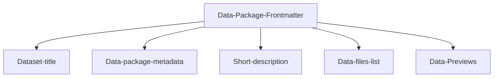

---
datapackage:
  title: Welcome to your template dataset page!
  description: This is a template for publishing your dataset with Datahub Cloud. 
  licenses:
  - path: http://opendatacommons.org/licenses/pddl/
    title: Open Data Commons Public Domain Dedication and License v1.0
  resources:
  - path: data.csv
    title: C02 PPM per decade
    name: c02-per-decade
    format: csv
    schema:
      fields:
      - name: year
        type: date
      - name: co2
        type: number
---

Welcome to the body of your dataset site. Everything above this section is part of the Data package front matter. 

# Overview

Here is a quick overview of the template structure:

![[Overview.png]]

## Structured data



Feel free to customize the data package frontmatter accordingly when publishing your own data. 

## Unstructured data

You can add as many markdown files to your GitHub repository as you like, and you can freely nest them in subdirectories. You can also enhance your content with other data visualisation components and markdown features.

> Note: For a full list of supported markdown features visit https://flowershow.app/docs/syntax

Here are some quick examples:

> [!info] This is cool!
> Here's a callout block.
> It supports **markdown** and [[Internal link|wikilinks]].

Or you can quickly embed a piece of code as follows:

```
const ExampleCode = () => {
  return <div> .... </div>;
};
```

## To read more about how this works, refer to the [docs page](docs).

