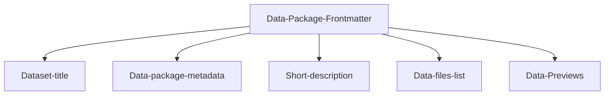

---
datapackage:
  title: Welcome to your template dataset page!
  description: This is a template for publishing your dataset with Datahub Cloud.
  created: 2024-01-01
  updated: 2024-01-31
  licenses:
  - path: http://opendatacommons.org/licenses/pddl/
    title: Open Data Commons Public Domain Dedication and License v1.0
  sources:
  - path: http://link.to/data/source
    title: Link to data source
  resources:
  - name: c02-per-decade
    title: C02 PPM per decade
    description: C02 PPM per decade
    lastModified: 2024-01-15
    path: data.csv
---

<div class="hero">
    <h1 class="hero-title">Readme.md content<br/></h1>
    <p class="hero-description">Welcome to the body of your site. Everything above this section is part of the Data package front matter. I am adding here markdown text and other data-rich elements and they render beautifully. </p>
</div>


# Overview

Here is a quick overview of the template structure:

![[Overview.png]]

## Structured data



Feel free to customize the data package frontmatter accordingly when publishing your own data. 

## What is the frontmatter

This is what we mean by the frontmatter:

```
---
datapackage:
  title: Welcome to your template dataset page!
  description: This is a template for publishing your dataset with Datahub Cloud.
  created: 2024-01-01
  updated: 2024-01-31
  licenses:
  - path: http://opendatacommons.org/licenses/pddl/
    title: Open Data Commons Public Domain Dedication and License v1.0
  sources:
  - path: http://link.to/data/source
    title: Link to data source
  resources:
  - name: c02-per-decade
    title: C02 PPM per decade
    description: C02 PPM per decade
    lastModified: 2024-01-15
    path: data.csv
---
```

You can either update it if you have some data files / datasets or delete it completely if you have markdown content only (suitable for blogs, data stories, articles, etc.)

## Unstructured data

You can add as many markdown files to your GitHub repository as you like, and you can freely nest them in subdirectories. You can also enhance your content with other data visualisation components and markdown features.

> Note: For a full list of supported markdown features visit [

Markdown syntax support](https://datahub.io/@olayway/docs/Markdown%20syntax%20support)

Here are some quick examples:

> [!info] This is cool!
> Here's a callout block.
> It supports **markdown** and ```[[Internal link|wikilinks]]```.

Or you can quickly embed a piece of code as follows:

```
const ExampleCode = () => {
  return <div> .... </div>;
};
```

### Take this template to the next level

> [!note]
> The template works best for datasets. If you don't have any data files, we suggest deleting the frontmatter and following this [quick tutorial on publishing data-rich stories](https://datahub.io/@olayway/docs/Publish%20data-rich%20stories)

You may also want to check out: 

<div class="middle-button-container">
    <a href="https://datahub.io/@olayway/docs/Customize%20Your%20DataHub%20Cloud%20Site%20with%20CSS" class="middle-button">Customize your site with CSS and HTML</a>
</div>

<div class="middle-button-container">
    <a href="https://datahub.io/@olayway/docs/Add%20visuals%20and%20data-rich%20components" class="middle-button">Add visuals and data-rich components</a>
</div>

<div class="middle-button-container">
    <a href="https://datahub.io/@olayway/docs/Add%20sidebar%20navigation" class="middle-button">Add sidebar navigation</a>
</div>

> [!important]
> For any questions, refer to the [Docs](https://datahub.io/@olayway/docs)

<div class="middle-button-container">
    <a href="https://datahub.io/@olayway/docs" class="middle-button">Read the docs</a>
</div>

