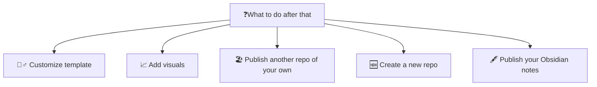

    <h1 class="hero-title">Documentation 📚</h1>
    
Welcome to Datahub Cloud documentation. Datahub Cloud is your stupidly simple and fast tool for turning your data stories or datasets on GitHub into a published, shareable site. It converts raw data and Markdown files into beautifully presented, interactive sites.

> [!note]
> The current version of Datahub Cloud runs only off Github.

# How to deploy your first site within seconds

The quickest way to start publishing with Datahub Cloud is to publish our template and customize it to fit your needs. You can do that in 5 simple steps:

1. Go to [template](https://github.com/datahubio/datahub-cloud-template) and click "Use this template" at the top right to create a new repository
2. Go to [the app](https://0613d040.sibforms.com/serve/MUIFAMLy5tXMDC-gFjXRxBEcvyVYV9O9KLVoKMp1n6WMXE4LBazZkkV78pTBf3FnJHdhQpJoOYL3KsAbAv9yDYJooerqar47yy2RQkuP_Vs0CEkHexRMrkWsbKtTIi_DMOa9KfzpRVFa959hSXqJByMY5Gj9OrZtEX3ZrfO5OJHh7fLxh3nYgnNIBwGTpxJ25XA_MxOKv_kHKNgM) and create a new site by selecting the repository you just created (leave the "Root Dir" field empty)
3. Done, it is now published! Just hit the green "Visit" button at the top right to see what it looks like.

# What to do after you publish your first site

After publishing our template and getting a feel for how it works, you have several options to customize it:

## Taking the template to the next level

It goes without saying that you can directly start by updating the .md file in your repo

    <h3 class="h3-title-heading">Customize your site with CSS and HTML 🧮📽️</h3>
    <a href="https://datahub.io/@olayway/docs/Customize%20Your%20DataHub%20Cloud%20Site%20with%20CSS" class="middle-button">How do I customize my site with CSS and HTML</a>

    <h3 class="h3-title-heading">Add some visuals 📊</h3>
    <a href="https://datahub.io/@olayway/docs/Add%20visuals%20and%20data-rich%20components" class="middle-button">How do I add visuals</a>

    <h3 class="h3-title-heading">Add sidebar navigation </h3>
    <a href="https://datahub.io/@olayway/docs/Add%20sidebar%20navigation" class="middle-button">How to add sidebar navigation</a>

## Starting from the scratch

Or if that's easier, you can start from scratch or from an existing repo in Github.

If you haven't worked with Github or your project does not live there, go ahead and create a new repository in Github. Create a README.md file, add some intro to it and publish it with Datahub Cloud.

    <a href="https://datahub.io/@olayway/docs/Create%20a%20dataset%20from%20scratch%20and%20publish%20it" class="middle-button">Create a dataset from scratch</a>

You can also publish an existing repository of your own and see what it looks like when published with Datahub Cloud. For any issues or errors, please open an issue here https://github.com/datopian/datahub/issues

## Publish your Obsidian vault

You can also publish your Obsidian notes and create your handbook with Datahub Cloud. Eg. see this beautiful example https://datahub.io/@davidgasquez/handbook. 

    <a href="https://datahub.io/@olayway/docs/Publish%20your%20Obsidian%20vault" class="middle-button">How to publish my Obsidian vault</a>

# What syntax is supported

Datahub Cloud supports CommonMark and GitHub Flavored Markdown, but also many Obsidian-specific syntax elements, like Wiki links or footnotes[^1].

For more syntax elements supported by Datahub Cloud, see [Markdown syntax support](https://datahub.io/@olayway/docs/Markdown%20syntax%20support)

## Need help?

For any questions or suggestions for improvement please ping us on [discord](https://discord.gg/URNSkepK7z)

