    
Datahub Cloud is your stupidly simple and fast tool for turning your data stories or datasets on GitHub into a published, shareable site. It converts raw data and Markdown files into beautifully presented, interactive sites.

>[!note]
>The current version of Datahub Cloud runs only off Github.

### Templates

- [Data-rich story template](https://github.com/datahubio/datahub-cloud-template-story) that renders like [this](https://datahub.io/@Daniellappv/datahub-cloud-template-story)
- [Dataset template](https://github.com/datahubio/datahub-cloud-template) that renders like [this](https://datahub.io/@Daniellappv/datahub-cloud-template-dataset)
- [PKM template](https://github.com/datahubio/datahub-cloud-template-pkm) that renders like [this](https://datahub.io/@Daniellappv/datahub-cloud-template-pkm)

### How to deploy your first site within seconds

The quickest way to start publishing with Datahub Cloud is to publish our template and customize it to fit your needs. You can do that in 5 simple steps:

1. Click on the selected template from the ones listed above and click "Use this template" at the top right to create a new repository
2. Go to [the app](https://0613d040.sibforms.com/serve/MUIFAMLy5tXMDC-gFjXRxBEcvyVYV9O9KLVoKMp1n6WMXE4LBazZkkV78pTBf3FnJHdhQpJoOYL3KsAbAv9yDYJooerqar47yy2RQkuP_Vs0CEkHexRMrkWsbKtTIi_DMOa9KfzpRVFa959hSXqJByMY5Gj9OrZtEX3ZrfO5OJHh7fLxh3nYgnNIBwGTpxJ25XA_MxOKv_kHKNgM) and create a new site by selecting the repository you just created (leave the "Root Dir" field empty)
3. Done, it is now published! Just hit the green "Visit" button at the top right to see what it looks like.

### What to do after you publish your first site

After publishing our template and getting a feel for how it works, you have several options to customize it:

```mermaid
  graph TD

whattodoafter["❓What to do after that"]
customize["👷‍♂️ Customize template"]
addvisuals["📈 Add visuals"]
publishrepo[" 🏖️ Publish another repo of your own"]
newrepo[" 🆕 Create a new repo"]
obsidian["🖋️ Publish your Obsidian notes"]

whattodoafter-->customize
whattodoafter-->addvisuals
whattodoafter-->publishrepo
whattodoafter-->newrepo
whattodoafter-->obsidian
```

### Take the template to the next level

> [!note]
> The template works best for datasets. If you don't have any data files, we suggest starting from scratch (go to [Start from scratch](https://datahub.io/docs#start-from-the-scratch))

    <a href="https://datahub.io/docs/Customize%20Your%20DataHub%20Cloud%20Site%20with%20CSS" className="middle-button">Customize your site with CSS and HTML</a>

    <a href="https://datahub.io/docs/Add%20visuals%20and%20data-rich%20components" className="middle-button">Add visuals and data-rich components</a>

    <a href="https://datahub.io/docs/Add%20sidebar%20navigation" className="middle-button">Add sidebar navigation</a>

### Start from the scratch

Or if that's easier, you can start from scratch or from an existing repo in Github.

If you haven't worked with Github or your project does not live there, go ahead and create a new repository in Github. Create a README.md file, add some intro to it and publish it with Datahub Cloud.

    <a href="https://datahub.io/docs/Create%20a%20dataset%20from%20scratch%20and%20publish%20it%20with%20Datahub%20Cloud" className="middle-button">Create a dataset from scratch</a>

You can also publish an existing repository of your own and see what it looks like when published with Datahub Cloud. For any issues or errors, please open an issue here https://github.com/datopian/datahub/issues

### Publish your Obsidian vault

You can also publish your Obsidian notes and create your handbook with Datahub Cloud. Eg. see this beautiful example https://datahub.io/@davidgasquez/handbook. 

    <a href="https://datahub.io/docs/How%20to%20push%20an%20Obsidian%20vault%20to%20a%20Github%20repository" className="middle-button">How to publish my Obsidian vault</a>

### What syntax is supported

Datahub Cloud supports CommonMark and GitHub Flavored Markdown, but also many Obsidian-specific syntax elements, like Wiki links or footnotes[^1].

    <a href="https://datahub.io/docs/Markdown%20syntax%20support" className="middle-button">See supported markdown syntax</a>

### Need help?

For any questions or suggestions for improvement please ping us on [discord](https://discord.gg/URNSkepK7z)

