```mermaid
  graph TD

whattodoafter["❓What to do after that"]
customize["👷‍♂️ Customize template"]
addvisuals["📈 Add visuals"]
publishrepo[" 🏖️ Publish another repo of your own"]
newrepo[" 🆕 Create a new repo"]
obsidian["🖋️ Publish your Obsidian notes"]

whattodoafter-->customize
whattodoafter-->addvisuals
whattodoafter-->publishrepo
whattodoafter-->newrepo
whattodoafter-->obsidian
```

# Docs 

## Datahub Cloud in a nutshell

Datahub Cloud is your stupidly simple and fast tool for turning your datasets and data-driven content on GitHub into a published, shareable site. It converts raw data and Markdown files into beautifully presented, interactive sites.

> [!note]
> The current version of Datahub Cloud runs only off Github.

# How to deploy my first site within seconds

The quickest way to start publishing with Datahub Cloud is to publish our template and customize it to fit your needs. You can do that in 5 simple steps:

1. Go to [template](https://github.com/datahubio/datahub-cloud-template) and click "Use this template" at the top right to create a new repository
2. Go to [the app](https://0613d040.sibforms.com/serve/MUIFAMLy5tXMDC-gFjXRxBEcvyVYV9O9KLVoKMp1n6WMXE4LBazZkkV78pTBf3FnJHdhQpJoOYL3KsAbAv9yDYJooerqar47yy2RQkuP_Vs0CEkHexRMrkWsbKtTIi_DMOa9KfzpRVFa959hSXqJByMY5Gj9OrZtEX3ZrfO5OJHh7fLxh3nYgnNIBwGTpxJ25XA_MxOKv_kHKNgM) and create a new site by selecting the repository you just created (leave the "Root Dir" field empty)
3. Done, it is now published! Just hit the green "Visit" button at the top right to see what it looks like.

# What to do after that

Once you published our template and you got an idea of how this works, you have several options on how to continue:

1. You can customize the template by editing the .md file in the repo and adding relevant data files (if any).
2. Explore different [visuals and data-rich components](https://datahub.io/@Daniellappv/datahub-cloud-template-2/docs/Add%20visuals%20and%20data-rich%20components) that you can add to your page
3. Publish an existing repository of your own and see what it looks like when published with Datahub Cloud. For any issues or errors, please open an issue here https://github.com/datopian/datahub/issues
4. Create a new repository in Github. Create a README.md file, add some information in it and publish it with Datahub Cloud. You can check out this [quick tutorial](https://datahub.io/@olayway/docs/Create%20a%20dataset%20from%20scratch%20and%20publish%20it) if you need guidance.
5. Publish your Obsidian notes. Here's a [quick tutorial](https://datahub.io/@olayway/docs/Publish%20your%20Obsidian%20vault) on how to do that

# What syntax is supported

Datahub Cloud supports CommonMark and GitHub Flavored Markdown, but also many Obsidian-specific syntax elements, like Wiki links or footnotes[^1].

For more syntax elements supported by Datahub Cloud, see [Markdown syntax support](https://datahub.io/@olayway/docs/Markdown%20syntax%20support)

